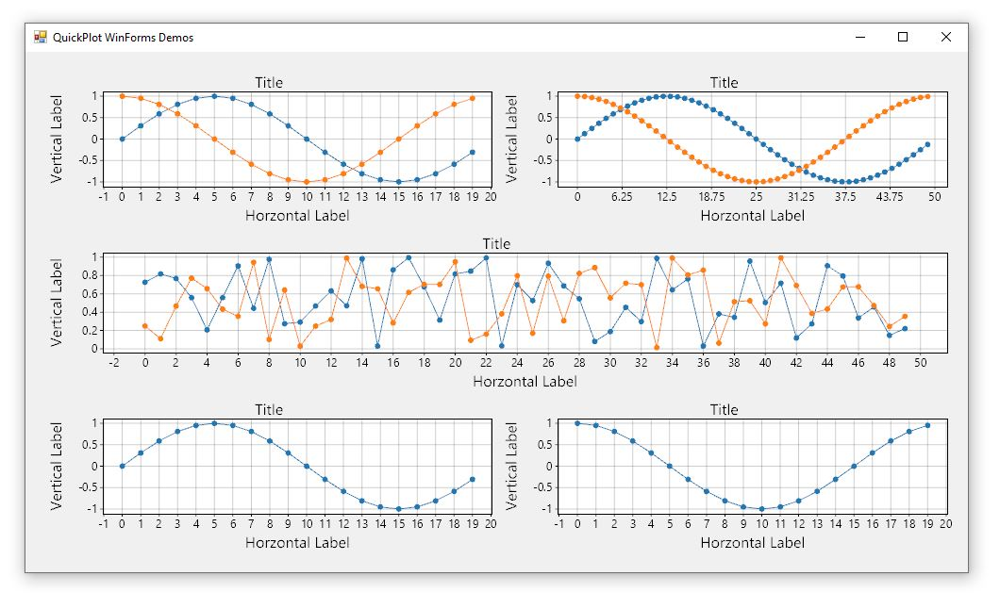

> **WARNING:** QuickPlot is early in development and not yet intended to be used. **[ScottPlot](https://github.com/swharden/ScottPlot)** is a mature and stable .NET library which can serve many plotting needs while QuickPlot is being developed.

---

# QuickPlot

**QuickPlot is a high-speed plotting library for .NET** that makes it easy to interactively display high density data (tens of millions of points). QuickPlot uses Google's Skia rendering engine (provided by [SkiaSharp](https://www.nuget.org/packages/SkiaSharp/)) which benefits from hardware acceleration (provided by [OpenTK.GLControl](https://www.nuget.org/packages/OpenTK.GLControl/)) on systems which support it. QuickPlot is written in .NET Standard so it can be used in both .NET Framework and .NET Core projects. An interactive user control is available for Windows Forms and WPF Applications. 

### Supported Platforms

QuickPlot can be used to save plots as images from Console Applications or ASP .NET, or interactively display plots using the InteractivePlot user control for WinForms or WPF.

Library | Platform | Function
---|---|---
QuickPlot | .NET Standard 2.0 | Plot data and return (or save) Bitmaps
QuickPlot.WinForms | .NET Framework 4.6.1 | Interactively display plots
QuickPlot.WPF | .NET Core 3.0 | Interactively display plots
